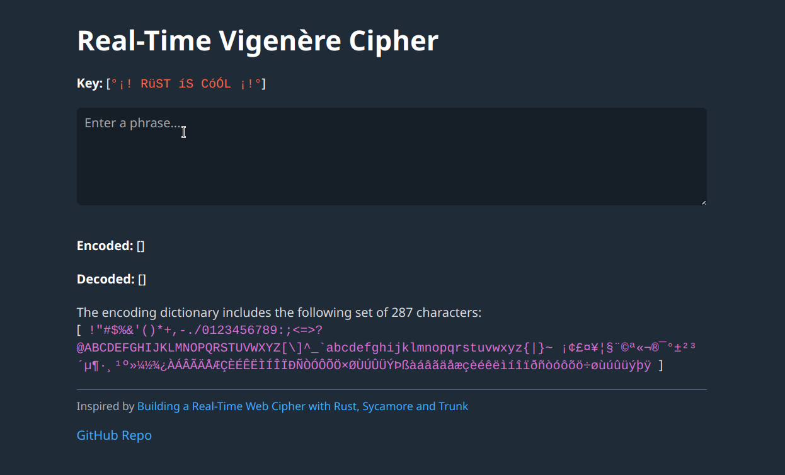

# Vigenère Cipher
> Based on Rust framework [MoonZoon](http://moonzoon.rs/)

Live demo: [moonzoon-vigenere.netlify.app](https://moonzoon-vigenere.netlify.app/)

Inspiration: [Building a Real-Time Web Cipher with Rust, Sycamore and Trunk](https://rsdlt.github.io/posts/rust-sycamore-trunk-wasm-iterators-vigenere-cipher/)
